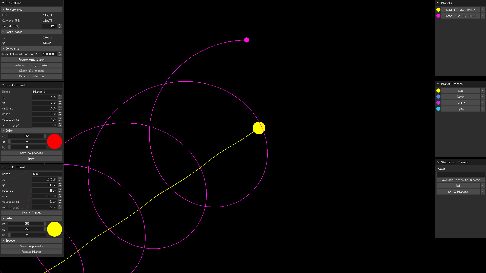

# PlanetSimulation
Basic simulation using Newton's law of universal gravitation

## Features
- [x] Planet merging
- [X] List of planets
- [x] Planet presets
- [x] Simulation presets
- [x] Planet Creator
- [X] Modification of planets

## Dependencies
Check for your system [https://ebitengine.org/en/documents/install.html](here)

## Libraries
[https://github.com/hajimehoshi/ebiten](ebitengine)

## Build
Use `./build.sh` to build for Windows and Linux. The built binary file will be in the created `build` directory.

